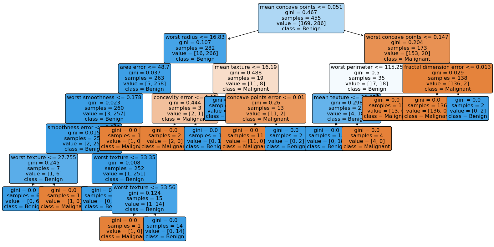

# Building a Decision Tree From Scratch in Python
My journey with tree-based methods began in 2020 when I first encountered decision trees in a machine learning course. Like many students, I started by implementing decision trees using established packages - first with rpart in R, and later with sklearn in Python. Through this experience, I came to appreciate the fundamental importance of decision trees as they serve as the foundation for more advanced tree-based algorithms. This recognition inspired me to build a decision tree algorithm from scratch. By implementing the algorithm myself rather than relying on existing packages, I aim to deepen my understanding of the underlying methodology while strengthening my Python programming skills.

## CART(Classification And Regression Tree) for Decision Tree
Decision trees are non-parametric supervised learning techniques, meaning they do not assume any specific distribution for the underlying data. Instead, they learn patterns directly from labeled data, where the target variable is known. One of the most widely used decision tree methodologies is CART (Classification and Regression Tree), first introduced by Breiman et al. in 1984. As its name suggests, CART can be applied to both classification and regression tasks, forming the foundation for many modern decision tree algorithms.

In this project, I first reviewed the general structure of the CART algorithm and provide a step-by-step guide to implementing it from scratch using only the pandas and numpy libraries in Python. Lastly, I tested my implementation on Python’s built-in datasets — the breast cancer dataset (for classification) and the diabetes dataset (for regression). The performance of my implementation will be compared with the established decision tree model available in the scikit-learn library.

## Decision Tree Visualization (Custom vs. Sklearn)
An example of the visualization of the custom decision tree for classification in DOT format. Idea inspired by the [blog post](https://blog.csdn.net/weixin_40722661/article/details/101631344).

An example of the visualization of the decision tree for classification using the plot_tree function. 

