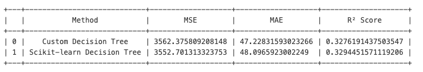

# 5. Testing the Algorithm
## 5.1 Testing case: Predicting Breast Cancer
To evaluate the algorithm's performance for classification tasks, I tested it using the Breast Cancer dataset from the sklearn library. The target variable in this dataset is binary, with two classes: 'malignant' and 'benign'. The goal of this test case is to predict whether a tumor is malignant or benign.

I first applied the custom decision tree algorithm to perform the classification task. Then, I compared its performance to the sklearn DecisionTreeClassifier. Both algorithms were tested using the same training and testing datasets, and the classification was performed using the Gini impurity criterion.

The results show that our custom algorithm achieved an accuracy of 92.98%, which is slightly lower than the 95% accuracy achieved by the sklearn implementation. This indicates that our custom algorithm can handle classification tasks effectively, but there is still room for improvement and optimization.

```python
# Test case: Predicting Breast Cancer
# Load data
breast_cancer = load_breast_cancer()
# print (breast_cancer.feature_names)
# print (breast_cancer.target_names)
data = pd.DataFrame(data=breast_cancer.data, columns=breast_cancer.feature_names)
data['target'] = breast_cancer.target
# Split data into test and train
X = data.iloc[:, :-1]
y = data['target']
X_train, X_test, y_train, y_test = train_test_split(X, y, test_size=0.2, random_state=42)
```
Predict using my custom algorithm:
```python
# Testing the algorithm using the customed alogrithm
train_data = np.hstack((X_train.values, y_train.values.reshape(-1, 1)))  # Merge features and target
target_index = train_data.shape[1] - 1  
tree = DecisionTree(max_depth=5, min_sample=10) 
tree.fit(train_data, target_index)
print(tree.tree)
tree_structure = tree.tree

# Predict using test set
predictions = [tree.predict(row) for row in X_test.values]

# Evaluate the model
accuracy = accuracy_score(y_test, predictions)
print(f"Accuracy: {accuracy * 100:.2f}%")
```
Predict using sklearn:
```python
# Build the decision tree using the sklearn package
decision_tree_classifier = DecisionTreeClassifier(criterion='gini', random_state=42)
decision_tree_classifier.fit(X_train, y_train)
predictions = decision_tree_classifier.predict(X_test)
print(f"Model's Accuracy: {accuracy_score(y_test, predictions):.2f}")
```

### 5.1.1 Decision Tree Visualization
The plot_tree function from the sklearn library is a commonly used tool when we want to visualize decision trees. However, to visualize the custom decision tree and better understand its structure and performance, I created a function that converts a tree dictionary into a DOT format file. This approach allows for a clear visualization of the tree and was inspired by a [blog post](https://blog.csdn.net/weixin_40722661/article/details/101631344). 

```python
# Decision Tree Visulization (custom)
def write_dot_file(tree, filepath, attrs=None, classes=None, depth=0, node_id=0):
    '''
    Convert a tree dictionary into a DOT file format.
    
    Parameters:
        tree: The tree structure as a nested dictionary.
        filepath: Path to save the DOT file.
        attrs: Feature names (optional).
        classes: Class names (optional).
        depth: Current depth (used internally for recursive node indexing).
        node_id: Current node ID (used internally for recursive node indexing).
    
    Returns:
        The next available node_id for indexing.
    '''
    def node_label(node):
        if isinstance(node, dict): # If the node is a dictionary, it is a terminal/decision node.
            # if attrs:
            #     feature = attrs[node['feature']]
            # else:
            #     feature = f"Feature {node['feature']}"
            feature = attrs[node['feature']] if attrs else f"Feature {node['feature']}"
            return f"{feature} <= {node['threshold']}"
        else:  # Leaf node
            return f"Class: {classes[int(node)] if classes else node}" # If classes is not provided, use the value of node directly as the class label

    with open(filepath, "w") as dot_file:
        dot_file.write("digraph Tree {\n")
        
        def recurse(node, parent_id=None):
            nonlocal node_id
            current_id = node_id
            node_id += 1
            
            # Writes a line to the opened DOT file to record the current node
            dot_file.write(f'    {current_id} [label="{node_label(node)}"];\n')
            
            # parent_id ensures the hierarchical structure. Each node has a parent node except the root node.
            if parent_id is not None:
                dot_file.write(f'    {parent_id} -> {current_id};\n')
            
            # Recurse for left and right children if node is a terminal/decision node
            if isinstance(node, dict):
                recurse(node['left'], current_id)
                recurse(node['right'], current_id)
        
        recurse(tree)
        dot_file.write("}")

feature_names = list(X_train.columns) 
class_names = ["Malignant", "Benign"] 

# Save the tree as a DOT file
write_dot_file(
    tree=tree_structure,
    filepath="decision_tree_update.dot",
    attrs=feature_names,
    classes=class_names
)
# Source.from_file("decision_tree_update.dot").view()
```


Below is the visualization of the decision tree generated using the sklearn package, created with the plot_tree function.


## 5.2 Testing case: Predicting Diabetes

To evaluate the algorithm's performance for **regression tasks**, I tested it using the Diabetes dataset from the sklearn library. This dataset contains 10 predictors and a target variable representing a quantitative measure of disease progression. [See the full dataset description](https://scikit-learn.org/1.5/datasets/toy_dataset.html). 

Again, the goal of this test is to compare the custom decision tree regressor against sklearn's DecisionTreeRegressor using the same training and testing datasets. The performance is assessed using common regression metrics: Mean Squared Error (MSE), Mean Absolute Error (MAE), and R² Score.

Both models achieve the same R² score (0.33) and show similar results for MSE and MAE, indicating a moderate fit to the data. While neither model fully captures the variance in the dataset, the results validate that our custom algorithm performs effectively and is competitive with sklearn's implementation.

```python
diabetes = load_diabetes()
# print(pd.isna(diabetes)) # check NA values
data_reg = pd.DataFrame(data=diabetes.data, columns=diabetes.feature_names)
data_reg['target'] = diabetes.target
# Split data into test and train
X = data_reg.iloc[:, :-1]
y = data_reg['target']
X_train, X_test, y_train, y_test = train_test_split(X, y, test_size=0.2, random_state=42)
```
Predict using my custom algorithm:
```python
# Combine X_train and y_train for custom algorithms
train_data = np.hstack((X_train.values, y_train.values.reshape(-1, 1))) 
target_index = train_data.shape[1] - 1  
reg_tree = DecisionTree(task = 'regression', criterion= 'mse', max_depth=5, min_sample=10) 
reg_tree.fit(train_data, target_index)
print(reg_tree.tree)

# Predict
tree_structure = reg_tree.tree
reg_predictions = [reg_tree.predict(row) for row in X_test.values]

# Evaluate custom Decision Tree for regression
custom_mse = mean_squared_error(y_test, reg_predictions)
custom_mae = mean_absolute_error(y_test, reg_predictions)
custom_r2 = r2_score(y_test, reg_predictions)
```
Model Comparision:


